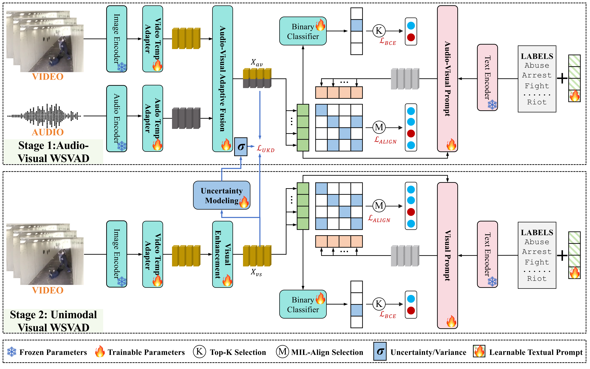

# AVadCLIP
This is the official PyTorch implementation of our papar:
**"AVadCLIP: Audio-Visual Collaboration for Robust Video Anomaly Detection"** in **TMM.**
> <a href="https://scholar.google.com.hk/citations?user=QkNqUH4AAAAJ" target="_blank">Peng Wu</a>, <a href="https://github.com/WanshunSu" target="_blank">Wanshun Su</a>, <a href="https://scholar.google.com.hk/citations?hl=zh-CN&user=1ZO7pHkAAAAJ" target="_blank">Guansong Pang</a>,  <a href="https://scholar.google.com.hk/citations?user=f4aAqXYAAAAJ" target="_blank">Yujia Sun</a>, <a href="https://scholar.google.com/citations?user=BSGy3foAAAAJ" target="_blank">Qingsen Yan</a>, <a href="https://scholar.google.com.au/citations?user=aPLp7pAAAAAJ" target="_blank">Peng Wang</a>, <a href="https://teacher.nwpu.edu.cn/m/en/1999000059.html" target="_blank">Yanning Zhang</a>



## Highlight

- We propose a WSVAD framework that harnesses audio-visual collaborative learning, leveraging CLIP's multimodal alignment capabilities. By incorporating a lightweight adaptive audio-visual fusion mechanism and integrating audio-visual information through prompt-based learning, our approach effectively achieves CLIP-driven robust anomaly detection in multimodal settings.

- We design an uncertainty-driven feature distillation module, which transforms deterministic estimation into probabilistic uncertainty estimation. This enables the model to capture feature distribution variance, ensuring robust anomaly detection performance even with unimodal data.

- Extensive experiments on two WSVAD datasets demonstrate that our method achieves superior performance in audio-visual scenarios, while maintaining robust anomaly detection results even in audio-absent conditions. 

## Training

### Setup
We extract CLIP features for XD-Violence and CCTV-Fights<sub><i>sub</i></sub> datasets, and realse the features and pretrained models as follows (Note: Due to licensing restrictions, only XD-Violence features and models are released):

| Benchmark | CLIP[Baidu] | CLIP | Wav2CLIP[Baidu] | Wav2CLIP | 
| :---: | :---: | :---: | :---: | :---: |
| XD-Violence | [Code: fbrm](https://pan.baidu.com/s/1A5udw8OVzAeS8g00cui8pQ) | [OneDrive](https://pan.baidu.com/s/1A5udw8OVzAeS8g00cui8pQ) | [Code: g9ju](https://pan.baidu.com/s/11KmJZhqAT83DYsckCagw3w) | [OneDrive](https://pan.baidu.com/s/11KmJZhqAT83DYsckCagw3w) |


## Acknowledgement

We are grateful for the following awesome project: [VadCLIP](https://github.com/nwpu-zxr/VadCLIP), [UEM](https://github.com/yangzhou321/Distillation_with_UEM).

## Citation

If you find this repo useful for your research, please consider citing our paper:

```bibtex
@article{wu2025avadclip,
  title={AVadCLIP: Audio-visual collaboration for robust video anomaly detection},
  author={Wu, Peng and Su, Wanshun and Pang, Guansong and Sun, Yujia and Yan, Qingsen and Wang, Peng and Zhang, Yanning},
  journal={arXiv preprint arXiv:2504.04495},
  year={2025}
}
```